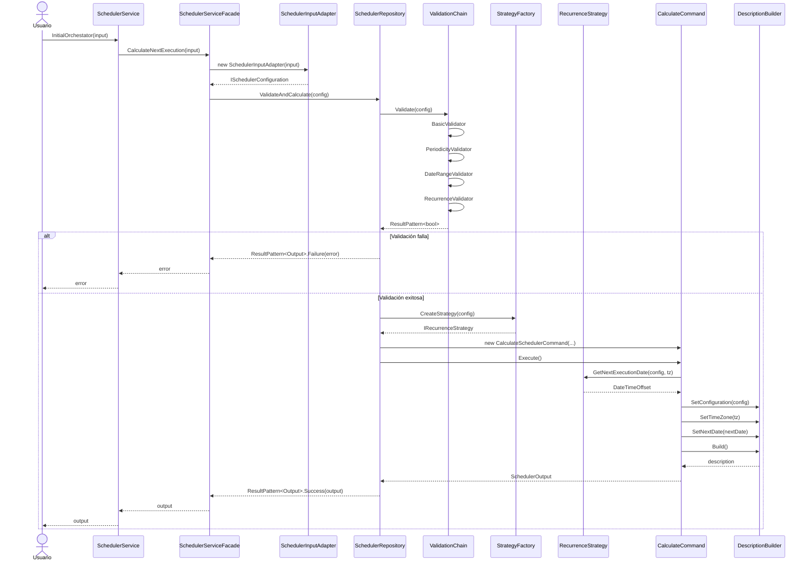
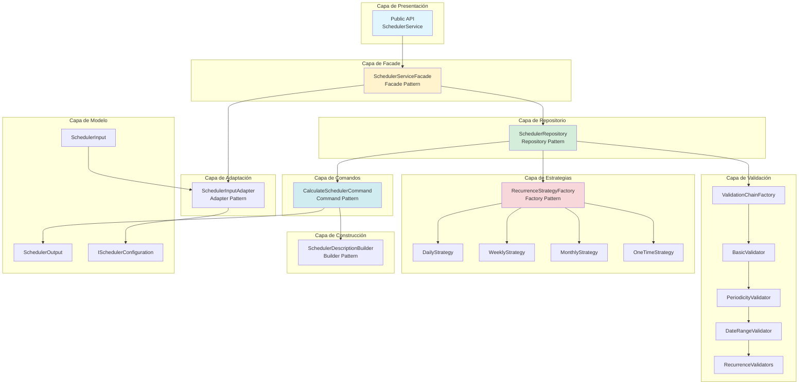
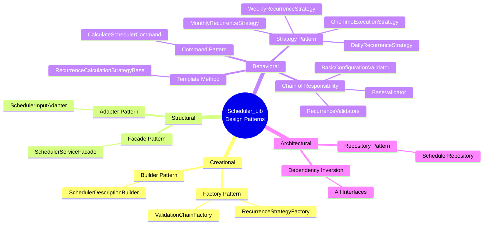
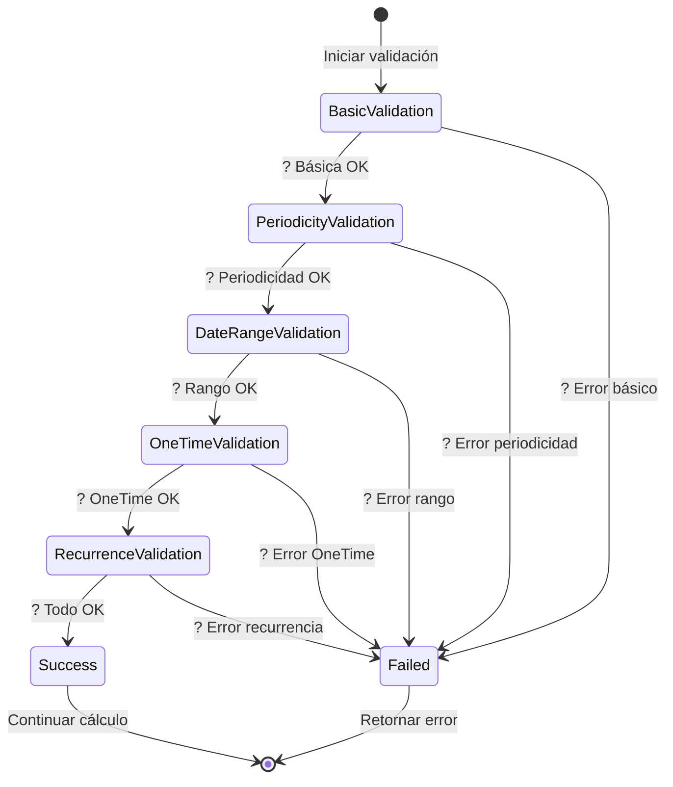
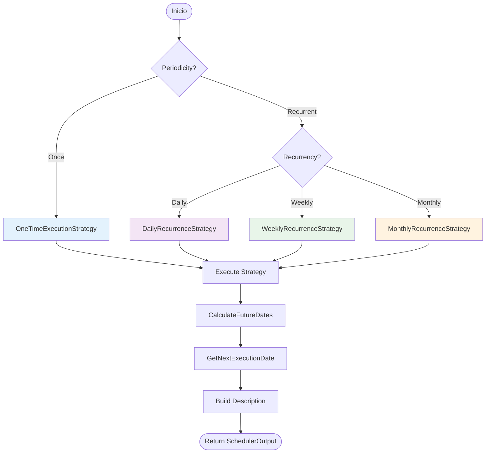
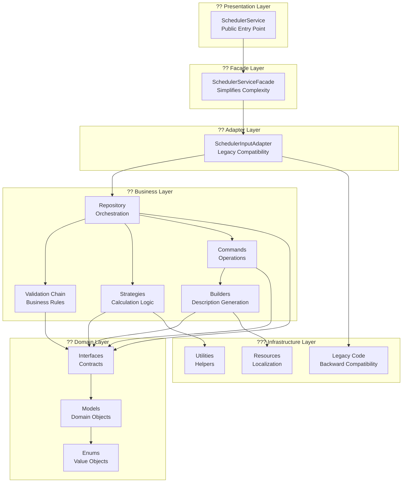
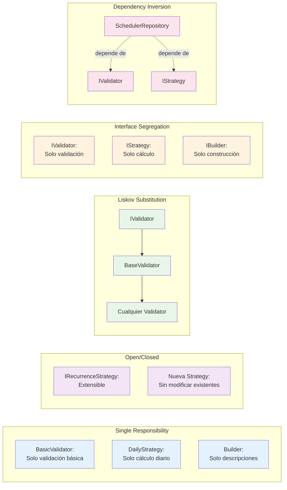
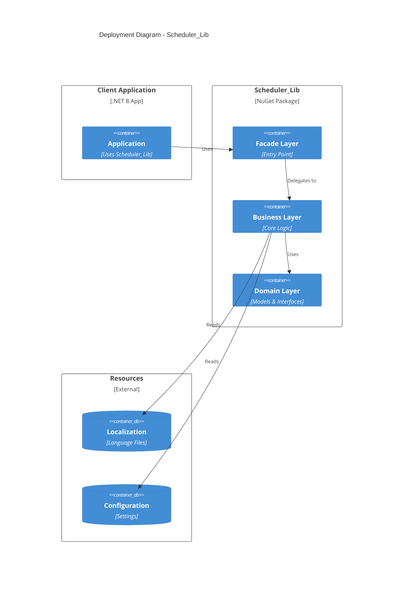

# ?? Diagramas de Arquitectura - Scheduler_Lib

## ??? Diagrama de Clases Principal

```mermaid
classDiagram
    %% Interfaces principales
    class ISchedulerConfiguration {
        <<interface>>
        +DateTimeOffset CurrentDate
        +EnumRecurrency Recurrency
        +EnumConfiguration Periodicity
        +string Language
        +DateTimeOffset StartDate
        +DateTimeOffset? EndDate
    }

    class IRecurrenceCalculationStrategy {
        <<interface>>
        +CalculateFutureDates(config, tz) List~DateTimeOffset~
        +GetNextExecutionDate(config, tz) DateTimeOffset
        +CanHandle(config) bool
    }

    class IValidator {
        <<interface>>
        +Validate(config) ResultPattern~bool~
        +SetNext(validator) void
    }

    class IDescriptionBuilder {
        <<interface>>
        +SetConfiguration(config) IDescriptionBuilder
        +SetTimeZone(tz) IDescriptionBuilder
        +SetNextDate(date) IDescriptionBuilder
        +Build() string
    }

    class ISchedulerRepository {
        <<interface>>
        +ValidateAndCalculate(config) ResultPattern~SchedulerOutput~
        +Calculate(config) SchedulerOutput
    }

    %% Implementaciones principales
    class SchedulerService {
        -SchedulerServiceFacade _facade$
        +InitialOrchestator(input)$ ResultPattern~SchedulerOutput~
    }

    class SchedulerServiceFacade {
        -ISchedulerRepository _repository
        +CalculateNextExecution(input) ResultPattern~SchedulerOutput~
    }

    class SchedulerRepository {
        -IRecurrenceStrategyFactory _strategyFactory
        -IValidator _validator
        +ValidateAndCalculate(config) ResultPattern~SchedulerOutput~
        +Calculate(config) SchedulerOutput
    }

    class SchedulerInputAdapter {
        -SchedulerInput _schedulerInput
        +DateTimeOffset CurrentDate
        +EnumRecurrency Recurrency
    }

    %% Estrategias
    class RecurrenceCalculationStrategyBase {
        <<abstract>>
        +CalculateFutureDates(config, tz) List~DateTimeOffset~
        +GetNextExecutionDate(config, tz) DateTimeOffset
        #CalculateDatesCore(config, tz, baseDto, endDate, accumulator)*
        #GetEffectiveEndDate(config, tz)* DateTimeOffset
    }

    class DailyRecurrenceStrategy {
        +CanHandle(config) bool
        #CalculateDatesCore(...) void
        #GetEffectiveEndDate(...) DateTimeOffset
    }

    class WeeklyRecurrenceStrategy {
        +CanHandle(config) bool
        #CalculateDatesCore(...) void
        #GetEffectiveEndDate(...) DateTimeOffset
    }

    class MonthlyRecurrenceStrategy {
        +CanHandle(config) bool
        #CalculateDatesCore(...) void
        #GetEffectiveEndDate(...) DateTimeOffset
    }

    class OneTimeExecutionStrategy {
        +CanHandle(config) bool
        #CalculateDatesCore(...) void
        #GetEffectiveEndDate(...) DateTimeOffset
    }

    %% Validadores
    class BaseValidator {
        <<abstract>>
        -IValidator _nextValidator
        +Validate(config) ResultPattern~bool~
        +SetNext(validator) void
        #DoValidate(config)* ResultPattern~bool~
    }

    class BasicConfigurationValidator {
        #DoValidate(config) ResultPattern~bool~
    }

    class WeeklyRecurrenceValidator {
        #DoValidate(config) ResultPattern~bool~
    }

    %% Factory y Builder
    class RecurrenceStrategyFactory {
        -List~IRecurrenceCalculationStrategy~ _strategies
        +CreateStrategy(config) IRecurrenceCalculationStrategy
    }

    class SchedulerDescriptionBuilder {
        -ISchedulerConfiguration _configuration
        -TimeZoneInfo _timeZone
        -DateTimeOffset _nextDate
        -string _language
        +SetConfiguration(config) IDescriptionBuilder
        +Build() string
    }

    %% Command
    class CalculateSchedulerCommand {
        -ISchedulerConfiguration _configuration
        -IRecurrenceCalculationStrategy _strategy
        -IDescriptionBuilder _descriptionBuilder
        -TimeZoneInfo _timeZone
        +Execute() SchedulerOutput
        +CanExecute() bool
    }

    %% Modelos
    class SchedulerInput {
        +DateTimeOffset CurrentDate
        +EnumRecurrency Recurrency
        +string Language
    }

    class SchedulerOutput {
        +DateTimeOffset NextDate
        +string Description
    }

    class ResultPattern~T~ {
        +bool IsSuccess
        +T Value
        +string Error
        +Success(value)$ ResultPattern~T~
        +Failure(error)$ ResultPattern~T~
    }

    %% Relaciones
    SchedulerService --> SchedulerServiceFacade : usa
    SchedulerServiceFacade --> SchedulerInputAdapter : crea
    SchedulerServiceFacade --> ISchedulerRepository : usa
    SchedulerRepository ..|> ISchedulerRepository : implementa
    SchedulerRepository --> IValidator : usa
    SchedulerRepository --> RecurrenceStrategyFactory : usa
    SchedulerRepository --> CalculateSchedulerCommand : crea

    SchedulerInputAdapter ..|> ISchedulerConfiguration : implementa
    SchedulerInputAdapter --> SchedulerInput : adapta

    RecurrenceCalculationStrategyBase ..|> IRecurrenceCalculationStrategy : implementa
    DailyRecurrenceStrategy --|> RecurrenceCalculationStrategyBase : hereda
    WeeklyRecurrenceStrategy --|> RecurrenceCalculationStrategyBase : hereda
    MonthlyRecurrenceStrategy --|> RecurrenceCalculationStrategyBase : hereda
    OneTimeExecutionStrategy --|> RecurrenceCalculationStrategyBase : hereda

    RecurrenceStrategyFactory --> IRecurrenceCalculationStrategy : crea

    BaseValidator ..|> IValidator : implementa
    BasicConfigurationValidator --|> BaseValidator : hereda
    WeeklyRecurrenceValidator --|> BaseValidator : hereda

    SchedulerDescriptionBuilder ..|> IDescriptionBuilder : implementa

    CalculateSchedulerCommand --> ISchedulerConfiguration : usa
    CalculateSchedulerCommand --> IRecurrenceCalculationStrategy : usa
    CalculateSchedulerCommand --> IDescriptionBuilder : usa
    CalculateSchedulerCommand --> SchedulerOutput : crea
```

---

## ?? Diagrama de Secuencia - Flujo Principal

---

## ??? Diagrama de Componentes

---

## ?? Diagrama de Patrones de Diseño

---

## ?? Diagrama de Estado - Validación

---

## ?? Diagrama de Flujo - Selección de Estrategia

---

## ??? Diagrama de Capas

---

## ?? Diagrama SOLID

---

## ?? Diagrama de Despliegue

---

**Generado automáticamente por la documentación de Scheduler_Lib**  
**Versión**: 2.0 - Refactorizada  
**Fecha**: Enero 2025
